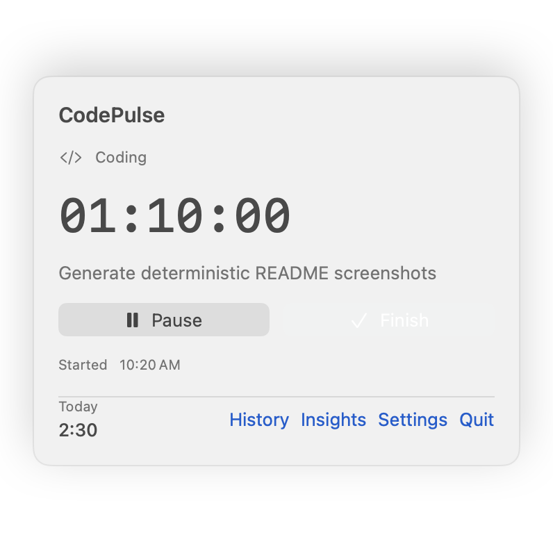
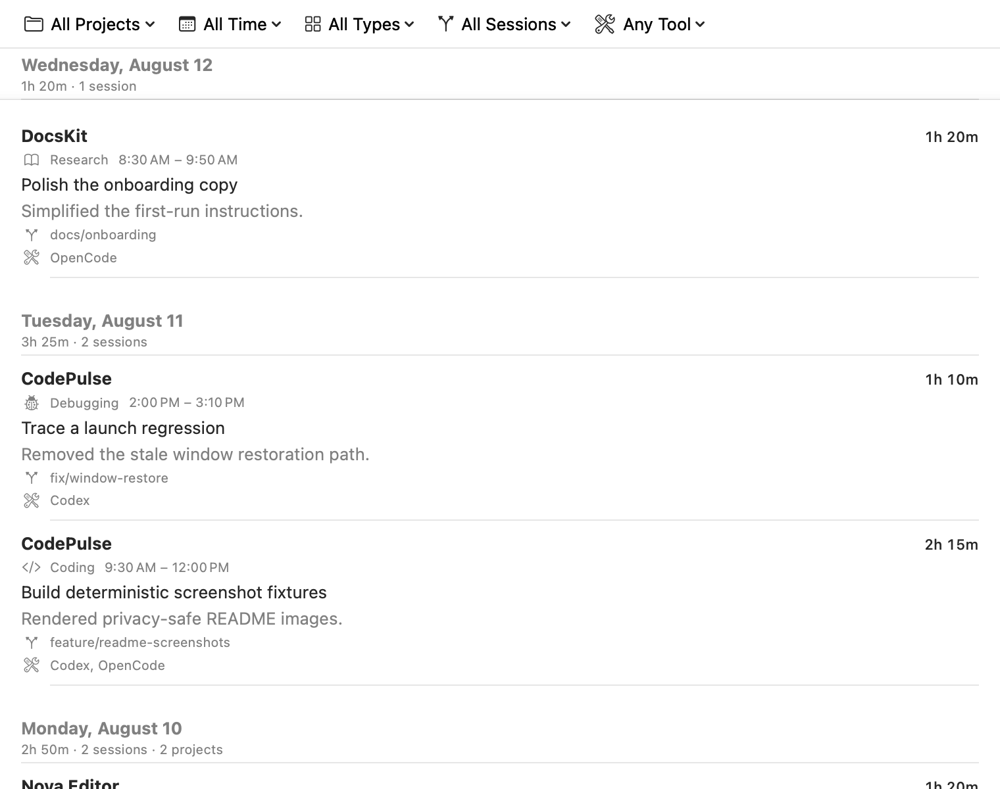
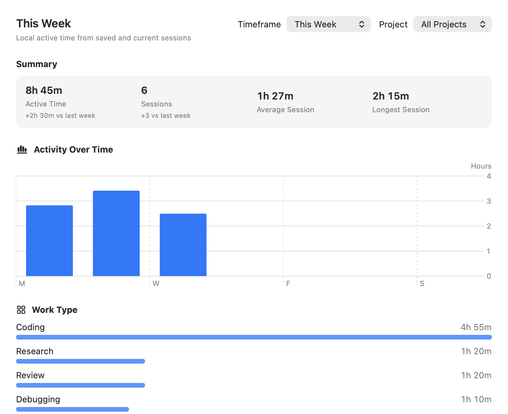

# CodePulse

[](https://github.com/joewolly/codepulse/actions/workflows/validation.yml)

[](https://github.com/sparkle-project/Sparkle)

CodePulse is a native macOS menu-bar timer, coding journal, and local insights
tool for developers. It is lightweight and local-first: there are no accounts,
cloud sync, telemetry, product analytics, or activity monitoring. CodePulse
contacts GitHub only to check for and download authenticated app updates or to
optionally enrich a local session with read-only repository, pull request, and
developer-tool metadata.

<p align="center">
  
</p>

## What it does

- Starts, pauses, resumes, and finishes focused work sessions from the menu bar.
- Records optional projects, work types, goals, and outcomes in a searchable
  coding journal.
- Captures best-effort local Git context without changing the repository.
- GitHub context — associates local sessions with their GitHub repository and
  optionally their current pull request when the repository has a GitHub remote.
- Receives optional local lifecycle metadata from Codex and OpenCode through a
  versioned, content-safe event boundary; dedicated per-tool run correlation is
  introduced incrementally by the agent-tracking roadmap. It records redacted
  receipt diagnostics without starting or controlling a CodePulse session.
- Provides richer local Insights for active time, sessions, projects, work types,
  developer-tool participation, Git activity, and GitHub context with native
  Swift Charts.
- Exports a versioned JSON backup of local CodePulse state.

## Download and install

CodePulse requires macOS 13 or later and is distributed as a Universal 2 app
for Apple silicon and Intel Macs.

Download the latest DMG from
[GitHub Releases](https://github.com/joewolly/codepulse/releases/latest), open
it, and drag CodePulse to Applications. The current build is intentionally not
Developer ID signed or notarized, so macOS may require an explicit first-launch
approval. Follow the safe first-launch instructions in
[`docs/releasing.md`](docs/releasing.md#installation-and-gatekeeper); do not
disable Gatekeeper globally.

Starting with CodePulse 0.4.2, authenticated in-app updates are provided by
Sparkle. After the initial installation, use **Settings → Check for Updates…**
or allow the automatic update check.

## Quick start

1. Click the CodePulse item in the menu bar.
2. Optionally choose a project and work type, then describe the session goal.
3. Start the session and pause or resume it as needed.
4. Finish the session, record an optional outcome, and save it to History.
5. Open History to search, filter, or edit saved sessions, or open Insights to
   review local activity and context-derived summaries.
6. If desired, open **Settings → Integrations** to enable Codex or OpenCode
   context enrichment. Integrations are optional and never control the timer.

Projects are optional. Adding a project grants CodePulse access only to the
folder you select, allowing it to read local Git metadata for that project.

## Screenshots

### History



### Insights



## Local data and privacy

CodePulse stores its state as JSON under the user's Application Support
directory. Session notes, project paths, settings, Git snapshots, GitHub context
snapshots, developer-tool session metadata, redacted v2 receipt diagnostics,
and active session state stay on the Mac unless the user exports or shares a
backup. The v2 diagnostics retain only receipt status, fixed redacted rejection
codes, parser/integration versions, and installation-salted event fingerprints.
CodePulse also keeps a local deduplication ledger of processed event identifiers
and timestamps (up to 2,048 entries; event processing prunes entries older than
30 days), which may appear in exported backups. Inbox cleanup after processing
is best effort, so a filesystem failure may leave a local event file. CodePulse
does not collect prompts, responses, transcripts, source code, terminal command
contents, command output, tool-call arguments or results, permission decisions,
reasoning, conversation summaries, or credentials.

Sparkle checks CodePulse release assets on GitHub. When `gh` is installed, the
optional GitHub Context feature uses the user's existing GitHub CLI setup for
read-only repository and pull request metadata. CodePulse does not store GitHub
credentials, and sessions still work without `gh`. See [`PRIVACY.md`](PRIVACY.md)
for the data-handling summary and [`SECURITY.md`](SECURITY.md) for vulnerability
reporting and the security model.

## Build from source

CodePulse is a Swift Package Manager application. On macOS with Xcode or a
Swift toolchain installed, run:

```sh
./script/build_and_run.sh
```

The script builds the package, stages a real app bundle, and launches it with
the macOS `open` command. To verify that the process starts:

```sh
./script/build_and_run.sh --verify
```

For release packaging, use `./script/package_release.sh` and follow
[`docs/releasing.md`](docs/releasing.md).

README screenshots are rendered from the real SwiftUI views with deterministic,
privacy-safe sample data. Regenerate them with:

```sh
./script/generate_readme_screenshots.sh
```

## Design notes

`SessionStore` owns the idle, running, paused, and finishing lifecycle. Session
duration is derived from timestamps and pause intervals rather than an
incrementing counter, which keeps recovery and calendar-boundary calculations
stable.

When a selected project is inside a local Git working tree, CodePulse reads the
repository root, branch, HEAD, and diff statistics at session boundaries. Git
capture is best-effort and read-only: failures never interrupt timing or saving.
Historical Git metadata is preserved when a completed session is edited.

CodePulse 0.5 adds GitHub Context for GitHub-hosted repositories: it can record the normalized
`owner/repository` identity and the pull request associated with the session's
branch. This enrichment is read-only, asynchronous, and failure-tolerant. It
uses the locally installed GitHub CLI (`gh`) when available; an authenticated
`gh` enables private repository and pull request metadata. CodePulse never asks
for or stores GitHub credentials and never sends session notes, timing, file
contents, or working-tree data to GitHub.

To inspect the optional CLI status yourself, use:

```sh
gh auth status
```

CodePulse's optional Developer Integrations use a small local helper to
normalize lifecycle metadata into `DeveloperEventV2`. The receiver validates
event size, schema, timestamp, integration, and idempotency before passing it
through CodePulse-owned v2 inboxes. It keeps bounded, redacted diagnostics and
never persists prompts, transcripts, source content, commands, or raw hook
bodies. The shared agent-run state machine defines active, waiting, review-
grace, ended, and orphaned timing for explicitly correlated agent runs;
dedicated per-tool correlation arrives in the next roadmap features. It does
not start or control a manual CodePulse session. See
[`docs/agent-run-state-machine.md`](docs/agent-run-state-machine.md) for the
event mapping and timing rules.

CodePulse 0.7 adds Session Intelligence to Insights. It derives active-time
metrics from the existing local session history, supports calendar and rolling
timeframes plus project filtering, and shows participation-based developer-tool
counts, optional model/profile labels, neutral Git Activity totals, and
historical GitHub repository and pull-request context. These are local derived
views only: CodePulse does not add an analytics database, upload analytics, or
measure productivity.

History filters before grouping sessions by day and searches existing project,
journal, GitHub, and developer-tool metadata. Insights uses the user's local
calendar, apportions active time across day and week boundaries while excluding
pauses, and keeps historical GitHub snapshots unchanged.

## Tests

Run the deterministic SwiftPM test suite with:

```sh
swift test --configuration debug
```

Tests use injected clocks and calendars, so timer, relaunch, history, Git,
GitHub, Insights, and backup behavior can be verified without sleeping.

## License

CodePulse is available under the [MIT License](LICENSE).
